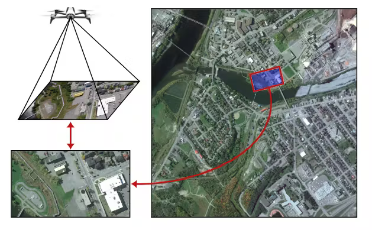
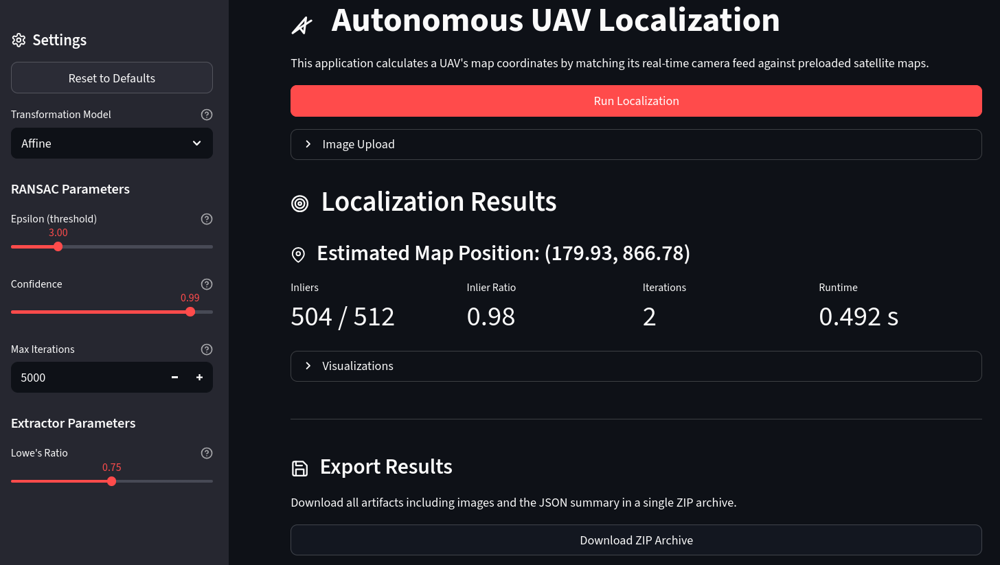

# Autonomous UAV Localization via Aerial-to-Satellite Registration

This project develops a vision-based localization engine that calculates a UAV's absolute geographic coordinates by matching its real-time camera feed against preloaded satellite maps. It provides a robust, passive alternative to GNSS navigation in electronically contested or signal-denied environments.



## Core Concepts

The system implements a robust geometric registration pipeline designed for cross-domain imagery (drone vs. satellite):

1.  **SIFT Feature Extraction:** We use the *Scale-Invariant Feature Transform* to detect interest points. Unlike simpler methods, SIFT is mathematically robust to the changes in altitude (scale) and heading (rotation) that occur during UAV flight.
2.  **FLANN Matching:** Descriptors are matched using the *Fast Library for Approximate Nearest Neighbors*. This allows us to search through tens of thousands of satellite features in milliseconds by using optimized KD-Tree data structures.
3.  **RANSAC Outlier Rejection:** In real-world data, up to 90% of matches can be false. *Random Sample Consensus* iteratively finds the largest subset of points that agree on a single geometric transformation, effectively "filtering out" the noise of moved cars, changing shadows, and seasonal variations.
4.  **Transformation Estimation (SVD):** We solve for the transformation matrix using *Singular Value Decomposition*. This provides higher numerical stability than standard solvers, preventing the coordinate "explosions" often seen when dealing with noisy GPS data.

## Project Structure

```text
├── app/
│   ├── app_cli/           # Command Line Interface application
│   └── app_ui/            # Interactive Streamlit GUI
├── localization/          # Core localization engine
│   ├── features/          # SIFT/ORB/SURF extractors
│   ├── transforms/        # Affine, Similarity, and Projective models
│   ├── ransac.py          # Robust parameter estimator
│   └── pipeline.py        # End-to-end localization logic
├── evaluation/            # Benchmarking and metrics suite
├── report/                # Technical report (LaTeX) and figures
├── configs/               # YAML configuration files
└── data/                  # Example maps and datasets
```

## Quick Start

### Installation
```bash
python -m venv .venv
source .venv/bin/activate
pip install -r requirements.txt
```

### 1. Interactive UI (Streamlit)
The easiest way to experiment with the pipeline is through the web-based GUI.
```bash
streamlit run app/app_ui/ui.py
```
**Features:**
- Real-time parameter tuning (SIFT ratio, RANSAC epsilon, etc.)
- Visual inspection of inlier matches and projected footprints.
- Export results as standardized ZIP archives.



### 2. Command Line Interface (Batch Processing)
```bash
python -m app.app_cli.cli --map path/to/map.tif --uav path/to/uav.jpg --config configs/default.yaml --output-dir outputs
```

## Benchmarks & Results

### Synthetic Dataset (Control Test)
Evaluated on 60 synthetically deformed satellite crops to verify mathematical correctness:
- **Success Rate:** 90%
- **RMSE:** 16.69 px
- **Mean Inlier Ratio:** 0.807

### Real-World Evaluation (UAV-VisLoc)
Comparative performance of models on the [UAV-VisLoc](https://github.com/IntelliSensing/UAV-VisLoc) dataset (50 samples):

| Model | Success Rate | RMSE (px) | Inlier Ratio | Runtime (s) |
| :--- | :---: | :---: | :---: | :---: |
| **Similarity** | 84% | 45,713 | 0.079 | 1.90 |
| **Affine** | 84% | 146,846 | 0.089 | 1.96 |
| **Projective** | 84% | **15,390** | **0.120** | 2.36 |

## Limitations & Future Roadmap

Our experiments on the **UAV-VisLoc** dataset revealed a significant "Domain Gap." Classical SIFT features struggle when the ground appearance changes between the satellite reference and the real-time drone feed (due to seasonal changes, construction, or different sensor types).

### Proposed Improvements:
- **Deep Learned Matching:** Transitioning to neural-network-based matchers like **LoFTR** or **SuperGlue** to find more stable correspondences in unconstrained environments.
- **Semantic Registration:** Matching based on infrastructure geometry (roads, building footprints) rather than raw pixels, which is naturally robust to lighting and weather changes.
- **Hierarchical Search:** Using global descriptors (e.g., **NetVLAD**) to narrow down the search area before performing fine-grained geometric matching.

## Sources & References

- **UAV-VisLoc Dataset:** Zhang, J. et al. (2021). [GitHub Repository](https://github.com/IntelliSensing/UAV-VisLoc)
- **SFD2: Semantic-Guided Matching:** Xue, F. et al. (CVPR 2023). [Paper Link](https://cvpr.thecvf.com/virtual/2023/poster/22070)
- **Feature Matching Overview:** Satya Mallick. [LearnOpenCV Guide](https://learnopencv.com/feature-matching/)
- **Vision-Based Localization:** Encord Guide. [Technical Blog](https://encord.com/blog/vision-based-localization-a-guide-to-vbl-technique/)
