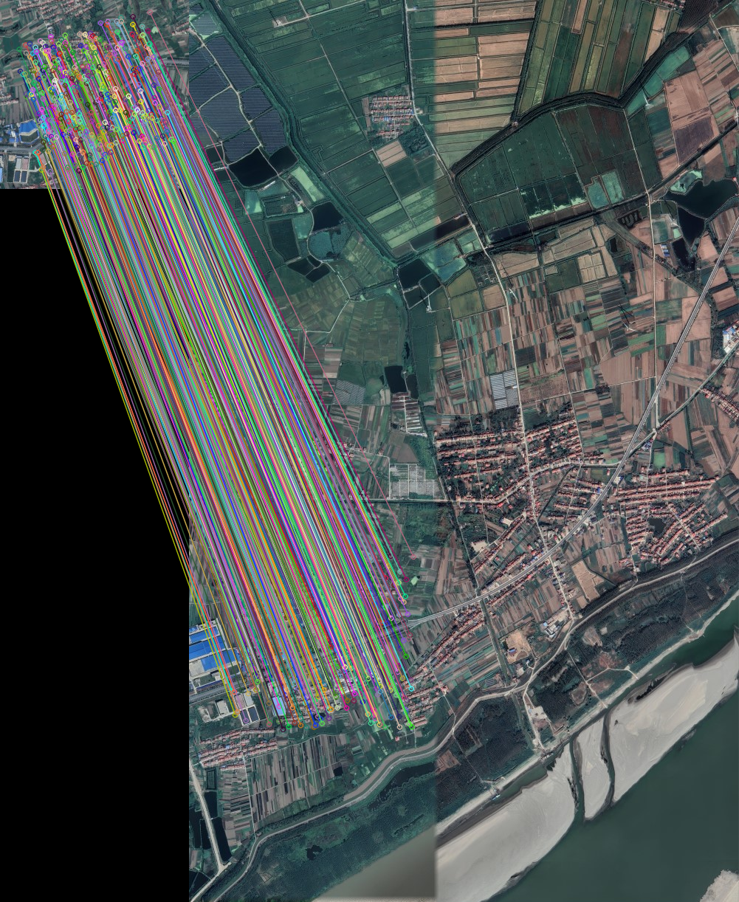
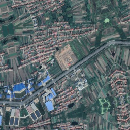
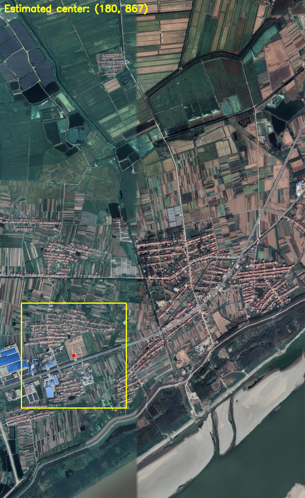
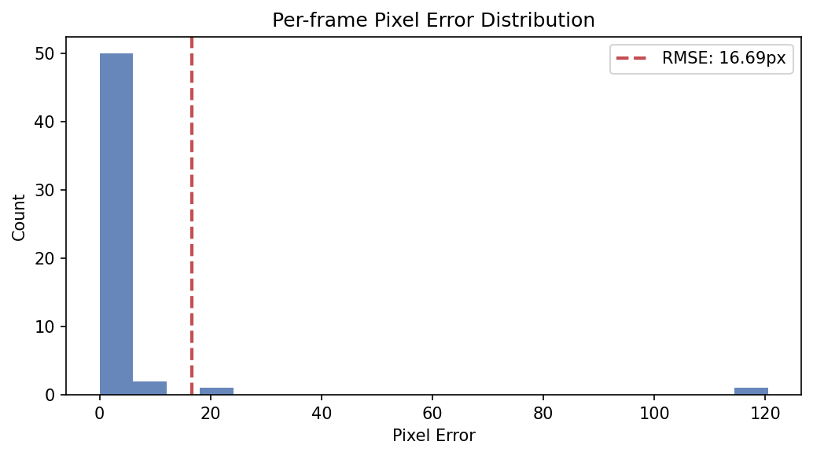
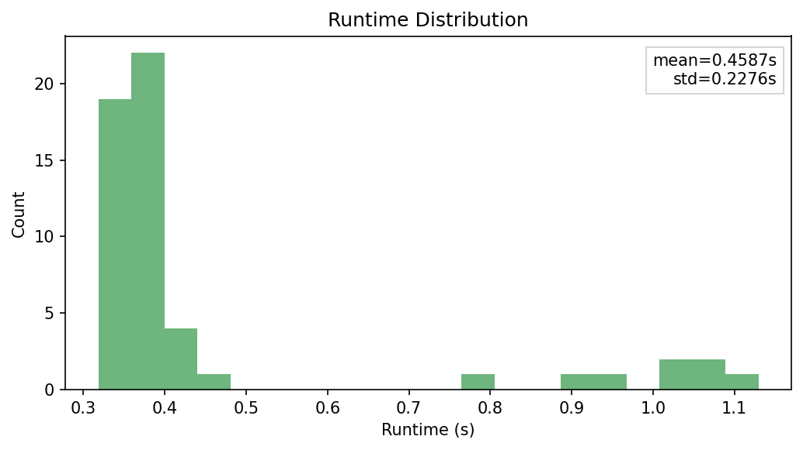

# UAV Image-to-Map Localization

This project localizes a UAV camera frame on a large satellite map.

In short: given one UAV image and one reference map image, the system estimates where the UAV frame center is located on the map and saves visual + JSON outputs.

## Problem We Solve

GPS can be noisy or unavailable in some conditions. We address a vision-based alternative: match the UAV image to a known satellite map and recover the UAV position directly from image content.

## Algorithms and Pipeline

Current implementation uses:

- SIFT keypoints and descriptors
- Descriptor matching with FLANN + ratio filtering
- RANSAC for robust outlier rejection
- Affine/Similarity geometric transform estimation

Pipeline flow:

1. Load map image and UAV image.
2. Detect and describe local features in both images.
3. Match descriptors between UAV and map.
4. Use RANSAC to keep geometrically consistent matches.
5. Estimate the transform and project UAV image center to map coordinates.
6. Save artifacts: raw matches, inlier matches, map overlay with estimated bounding box, JSON summary.

## Evaluation and Current Results

### Single Image Localization

- Raw matches: 478
- Inliers after RANSAC: 471
- Runtime: 1.045 s
- Estimated map position: (179.99, 866.84) px

Example outputs:

**Figure 1. Inlier matches after RANSAC**



| Figure 2. Input UAV frame | Figure 3. Estimated UAV location on map |
| --- | --- |
|  |  |

### Dataset Evaluation

- Frames processed: 60
- Successful localizations: 54 (90%)
- RMSE: 16.69 px
- Mean runtime: 0.459 +/- 0.228 s
- Mean inlier ratio: 0.807

Evaluation plots:

**Figure 4. Error distribution**



**Figure 5. Runtime distribution**



## Project Structure

- `localization/` contains the core computer-vision localization logic: feature extraction/matching, transformation models, model-agnostic RANSAC, and the main pipeline that outputs UAV map coordinates.
- `evaluation/` contains synthetic data generation and benchmarking utilities: frame generation, metric computation (RMSE, runtime, inlier ratio), and plot creation.
- `app/app_cli/` is the production command-line app for one map/UAV pair. It handles arguments, configuration loading, pipeline execution, rendering of overlays, and JSON summary export.
- `app/app_ui/` provides the Streamlit UI for interactive experiments and quick visual checks.
- `configs/default.yaml` is the central runtime configuration for extractor/model selection and RANSAC/evaluation parameters.
- `data/` stores reference map images and prepared synthetic datasets used for experiments.
- `generate_and_evaluate.py` is the end-to-end script to generate synthetic samples and evaluate localization in one run.
- `report/` contains the written project report and figure assets used for documentation.

## Installation

```bash
python -m venv .venv
source .venv/bin/activate
pip install -r requirements.txt
```

## Usage

### Run CLI Localization for One UAV Frame

**Run command:**

```bash
python -m app.app_cli.cli \
  --map <MAP_IMAGE_PATH> \
  --uav <UAV_IMAGE_PATH> \
  --config <CONFIG_PATH> \
  --output-dir <OUTPUT_DIR> \
  [--log-level <DEBUG|INFO|WARNING|ERROR|CRITICAL>] \
  [--log-file <LOG_FILE_PATH>]
```

**Parameter quick reference:**

- `--map`: path to the reference satellite map image.
- `--uav`: path to the UAV frame/image to localize.
- `--config`: path to the YAML configuration file.
- `--output-dir`: folder where output images and JSON summary are saved.
- `--log-level` (optional): logging verbosity (`DEBUG`, `INFO`, `WARNING`, `ERROR`, `CRITICAL`).
- `--log-file` (optional): file path to save logs.

**Example command:**

```bash
python -m app.app_cli.cli \
  --map data/examples/satellite_example.tif \
  --uav data/examples/uav_example_01.png \
  --config configs/default.yaml
```

**Main outputs are written to `outputs/`:**

- `matches_before_ransac.png`
- `matches_after_ransac.png`
- `map_with_estimated_bbox.png`
- `localization_summary.json`
